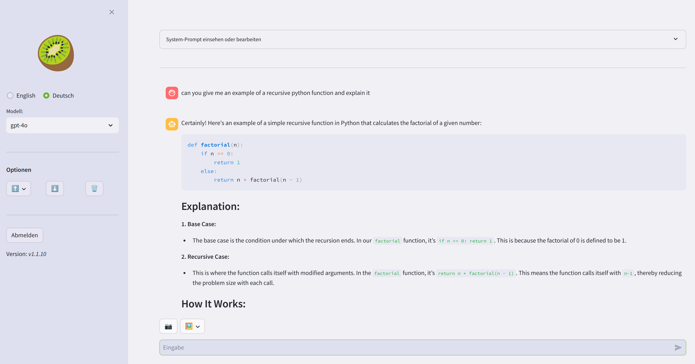

# Kiwi

Kiwi is a proxy to unify access to large language models for universities, currently tailored towards Open AI's chat models.



Some of its features are:
- Multi-language support (currently English and German)
- Simple interface to Open AI's chat models
- LDAP-Support
- Modifiable chatbot prompts
- Saving and deleting conversations

# Usage & Configuration

We provide a docker container image in the GitHub repository.

You can configure the service using environment variables.
See the docker compose example below for the list of variables that you can set.
Additionally, you might want to change the logo by overwriting the existing logo in `/kiwi/img/logo.svg`

A docker compose file could look like this:

```yml
---
version: '3'
services:
  kiwi:
    image: ghcr.io/virtuos/kiwi:main
    container_name: kiwi
    restart: unless-stopped
    ports:
      - '127.0.0.1:8501:8501'
    environment:
      # App name (english, german):
      APP_NAME_EN: "Kiwi"
      APP_NAME_DE: "Kiwi"
      # OpenAI settings:
      OPENAI_API_KEY: "CHANGE!"
      OPENAI_MODEL: 'gpt-4'
      # User settings
      USER_MODELS: '{"user1":"gpt-3.5","user2":"gpt-3.5"}'
      # App customizations:
      # German service sites
      DATENSCHUTZ_DE: 'https://www.example.org/de/datenschutz/'
      IMPRESSUM_DE: 'https://www.example.org/de/impressum/'
      # English service sites
      DATENSCHUTZ_EN: 'https://www.example.org/en/privacy/'
      IMPRESSUM_EN: 'https://www.example.org/en/legal/'
      # Your Institution
      INSTITUTION_EN: "Osnabrück University"
      INSTITUTION_DE: "Universität Osnabrück"
      # LDAP settings:
      LDAP_SERVER: 'ldap.example.org'
      LDAP_PORT: 636
      LDAP_BASE_DN: 'ou=people,dc=example-org,dc=de'
      LDAP_USER_DN: 'uid={username},ou=people,dc=example-org,dc=de'
      LDAP_SEARCH_FILTER: '(uid={username})'
      # Cookie settings:
      COOKIES_PASSWORD: "CHANGE!"
      COOKIES_PREFIX: "virtuos/kiwi"
    volumes:
      # Here you can override the default logo of the app
      - './logo.svg:/kiwi/img/logo.svg'
      # You could do the same for the promtps:
      # - './chat_basic_prompts_de.yml:/kiwi/prompts_config/chat_basic_prompts_de.yml
      # - './chat_basic_prompts_en.yml:/kiwi/prompts_config/chat_basic_prompts_en.yml
```

## Development

The app is developed in the [streamlit](https://streamlit.io/) framework.

You can install the requirements needed to run and develop the app using `pip install -r requirements.txt`.
Then simply run a development server like this:

```bash
streamlit run start.py
```

## Authors

virtUOS
